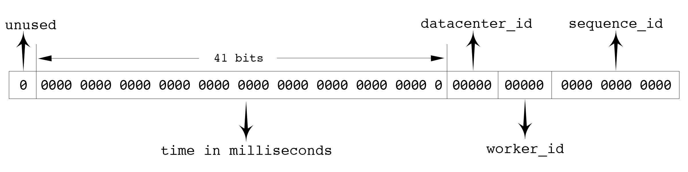

### 基础介绍
分布式id内应该包含一些时间信息，这样即使后端的系统对消息进行了分库分表，也能够以时间顺序对这些消息进行排序。
Twitter 的 snowflake 算法是这种场景下的一个典型解法，原理如图：

首先确定的是，id 数值长度是64位，int64 类型，被分为四个部分（不含开头的符号 / unused ）：

*   41 位来表示收到请求时的时间戳，单位为毫秒
*   5 位表示数据中心的 id
*   5 位表求机器的实例 id
*   12 位为循环自增 id
*   到达1111,1111,1111后归0

这样的机制可以支持一台机器在一毫秒内能够产生4096条消息。一秒共 409.6w 条消息。从值域上来讲完全够用。数据中心 id 加上实例 id 共有 10 位，每个数据中可以部署 32 台实例，搭建 32 个数据中心，所以可以一共部署 1024 台实例。41 位的时间戳（毫秒为单位）能够使用 69 年。

`timestamp`，`datacenter_id`，`worker_id`和`sequence_id`这四个字段中，`timestamp`和`sequence_id`是由程序在运行期生成的。但`datacenter_id`和`worker_id`需要在部署阶段就能够获取得到，并且一旦程序启动之后，就是不可更改的了。如果可以随意更改，可能被不慎修改，造成最终生成的 id 有冲突。

一般不同数据中心的机器，会提供对应的获取数据中心 `id` 的 `API`，所以`datacenter_id`我们可以在部署阶段轻松地获取到。而`worker_id`是我们逻辑上给机器分配的一个`id`，这个要怎么办呢？比较简单的想法是由能够提供这种自增`id` 功能的工具来支持，比如`MySQL`:

    mysql> insert into a (ip) values("10.1.2.101");
    Query OK, 1 row affected (0.00 sec)

    mysql> select last_insert_id();
    +------------------+
    | last_insert_id() |
    +------------------+
    |                2 |
    +------------------+
    1 row in set (0.00 sec)

从 `MySQL` 中获取到`worker_id`之后，就把这个`worker_id`直接持久化到本地，以避免每次上线时都需要获取新的`worker_id`。让单实例的`worker_id`可以始终保持不变。

当然，使用`MySQL` 相当于给我们简单的`id`生成服务增加了一个外部依赖。依赖越多，我们的服务的可运维性就越差。

考虑到集群中即使有单个id生成服务的实例挂了，也就是损失一

### 标准 snowflake

`github.com/bwmarrin/snowflake` 是一个相当轻量化的 snowflake 的 Go 实现。其文档对各位使用的定义如下图所示：

此库和标准的 `snowflake` 实现方式全完一致，使用也比较简单：

    package main

    import (
        // 示例代码只导入提供核心功能的package，其他内置package自行导入，下同
        "github.com/bwmarrin/snowflake"
    )

    func main() {
        node, err := snowflake.NewNode(1)
        if err != nil {
            println(err.Error())
            os.Exit(1)
        }

        for i := 0; i < 20; i++ {
            id := node.Generate()

            fmt.Printf("Int64  ID: %d\n", id)
            fmt.Printf("String ID: %s\n", id)
            fmt.Printf("Base2  ID: %s\n", id.Base2())
            fmt.Printf("Base64 ID: %s\n", id.Base64())

            fmt.Printf("ID Time  : %d\n", id.Time())

            fmt.Printf("ID Node  : %d\n", id.Node())

            fmt.Printf("ID Step  : %d\n", id.Step())

            fmt.Println("---------------------------------------------")
        }

    }

这个库因为是单文件，所以也方便定制，其源码本身就预留了一些可定制字段：

    var (
        // Epoch is set to the twitter snowflake epoch of Nov 04 2010 01:42:54 UTC in milliseconds
        // You may customize this to set a different epoch for your application.
        Epoch int64 = 1288834974657

        // NodeBits holds the number of bits to use for Node
        // Remember, you have a total 22 bits to share between Node/Step
        NodeBits uint8 = 10

        // StepBits holds the number of bits to use for Step
        // Remember, you have a total 22 bits to share between Node/Step
        StepBits uint8 = 12
    )

`Epoch`为起始时间，`NodeBits`是实例`id`的位长，`StepBits`是自增`id`的位长。
