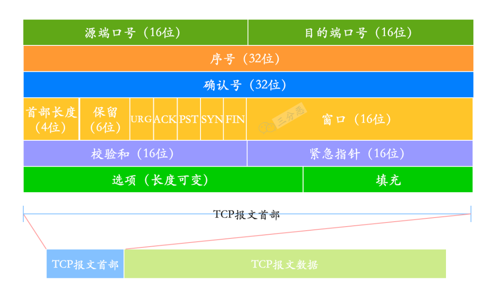
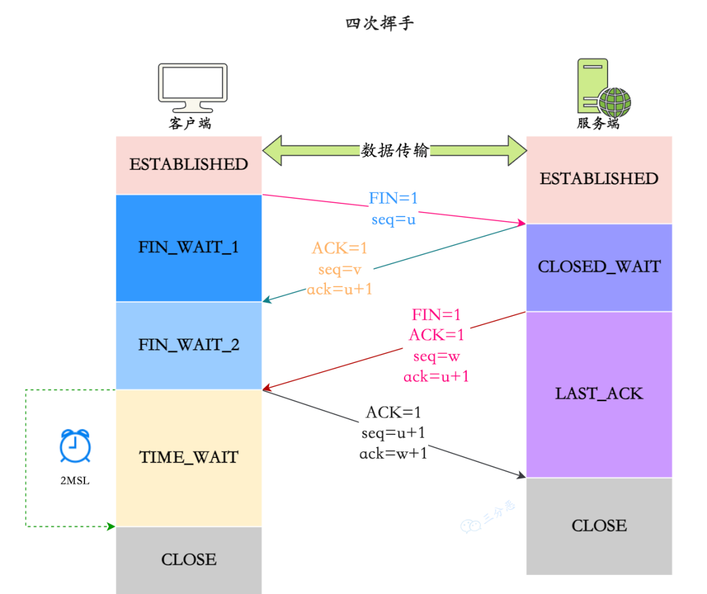

### HTTP协议

1. 说下 HTTP1.0，1.1，2.0 的区别？

### Websocket

1. **WebSocket 有哪些特点?**

   （1）建立在 TCP 协议之上，服务器端的实现比较容易。

   （2）与 HTTP 协议有着良好的兼容性。默认端口也是80和443，并且握手阶段采用 HTTP 协议，因此握手时不容易屏蔽，能通过各种 HTTP 代理服务器。

   （3）数据格式比较轻量，性能开销小，通信高效。

   （4）可以发送文本，也可以发送二进制数据。

   （5）没有同源限制，客户端可以与任意服务器通信。

2. 

### TCP/IP协议

1. **说一下每一层对应的网络协议有哪些？**
    

2. **详细说一下 TCP的三次握手机制**

  那我再说一下三次握手的过程：

  ①、第一次握手：SYN（最开始都是 CLOSE，之后服务器进入 LISTEN）

  - **发起连接**：客户端发送一个 TCP 报文段到服务器。这个报文段的头部中，SYN 位被设置为 1，表明这是一个连接请求。同时，客户端会随机选择一个序列号（Sequence Number），假设为 x，发送给服务器。
  - **目的**：客户端通知服务器它希望建立连接，并告知服务器自己的初始序列号。
  - **状态**：客户端进入 SYN_SENT 状态。

  ②、第二次握手：SYN + ACK

  - **确认并应答**：服务器收到客户端的连接请求后，如果同意建立连接，它会发送一个应答 TCP 报文段给客户端。在这个报文段中，SYN 位和 ACK 位都被设置为 1。服务器也会选择自己的一个随机序列号，假设为 y，并将客户端的序列号加 1（即 x+1）作为确认号（Acknowledgment Number），发送给客户端。
  - **目的**：服务器告诉客户端，它的连接请求被接受了，并通知客户端自己的初始序列号。
  - **状态**：服务器进入 SYN_RCVD 状态。

  ③、第三次握手：ACK

  - **最终确认**：客户端收到服务器的应答后，还需要向服务器发送一个确认。这个 TCP 报文段的 ACK 位被设置为 1，确认号被设置为服务器序列号加 1（即 y+1），而自己的序列号是 x+1。

  - **目的**：客户端确认收到了服务器的同步应答，完成三次握手，建立连接。

  - **状态**：客户端进入 ESTABLISHED 状态，当服务器接收到这个包时，也进入 ESTABLISHED 状态

    

3. **tcp-握手为什么是三次-为什么不能是两次-不能是四次**

使用三次握手可以建立一个可靠的连接。这一过程的目的是确保双方都知道对方已准备好进行通信，并同步双方的序列号，从而保持数据包的顺序和完整性。

为什么 TCP 握手不能是两次？

- 为了防止服务器一直等，等到黄花菜都凉了。

- 为了防止客户端已经失效的连接请求突然又传送到了服务器。

4. **说说-tcp-报文头部的格式**

   一个 TCP 报文段主要由报文段头部（Header）和数据两部分组成。头部包含了确保数据可靠传输所需的各种控制信息，比如说序列号、确认号、窗口大小等。

   

   - **源端口号**（Source Port）：16 位（2 个字节），用于标识发送端的应用程序。
   - **目标端口号**（Destination Port）：也是 16 位，用于标识接收端的应用程序。
   - **序列号**（Sequence Number）：32 位，用于标识从 TCP 发送者发送的数据字节流中的第一个字节的顺序号。确保数据按顺序接收。
   - **确认号**（Acknowledgment Number）：32 位，如果 ACK 标志被设置，则该字段包含发送确认的序列号，即接收 TCP 希望收到的下一个序列号。
   - **数据偏移**（Data Offset）：4 位，表示 TCP 报文头部的长度，用于指示数据开始的位置。
   - **保留**（Reserved）：6 位，为将来使用预留，目前必须置为 0。
   - **控制位**（Flags）：共 6 位，包括 URG（紧急指针字段是否有效）、ACK（确认字段是否有效）、PSH（提示接收端应该尽快将这个报文段交给应用层）、RST（重置连接）、SYN（同步序号，用于建立连接）、FIN（结束发送数据）。
   - **窗口大小**（Window）：16 位，用于流量控制，表示接收端还能接收的数据的字节数（基于接收缓冲区的大小）。
   - **校验和**（Checksum）：16 位，覆盖整个 TCP 报文段（包括 TCP 头部、数据和一个伪头部）的校验和，用于检测数据在传输过程中的任何变化。
   - **紧急指针**（Urgent Pointer）：16 位，只有当 URG 控制位被设置时才有效，指出在报文段中有紧急数据的位置。

5. **说说半连接队列和 SYN Flood 攻击的关系？**

   TCP 进入三次握手前，服务端会从 **CLOSED** 状态变为 **LISTEN** 状态, 同时在内部创建了两个队列：半连接队列（SYN 队列）和全连接队列（ACCEPT 队列）。

   TCP 三次握手时，客户端发送 SYN 到服务端，服务端收到之后，便回复 **ACK 和 SYN**，状态由 **LISTEN 变为 SYN_RCVD**，此时这个连接就被推入了 **SYN 队列**，即半连接队列。

   什么是 SYN Flood ？

   SYN Flood 是一种典型的 DDos 攻击，它在短时间内，伪造**不存在的 IP 地址**, 向服务器发送大量 SYN 报文。当服务器回复 SYN+ACK 报文后，不会收到 ACK 回应报文，那么 SYN 队列里的连接旧不会出对队，久⽽久之就会占满服务端的 **SYN** 接收队列（半连接队列），使得服务器不能为正常⽤户服务。

6. **说说 TCP 四次挥手的过程？**

   

   第一次挥手（FIN）：客户端向服务器发送一个 FIN（结束）报文，表示客户端没有数据要发送了，但仍然可以接收数据。客户端进入 FIN-WAIT-1 状态。

   第二次挥手（ACK）：服务器接收到 FIN 报文后，向客户端发送一个 ACK 报文，确认已接收到客户端的 FIN 请求。服务器进入 CLOSE-WAIT 状态，客户端进入 FIN-WAIT-2 状态。

   第三次挥手（FIN）：服务器向客户端发送一个 FIN 报文，表示服务器也没有数据要发送了。服务器进入 LAST-ACK 状态。

   第四次挥手（ACK）：客户端接收到 FIN 报文后，向服务器发送一个 ACK 报文，确认已接收到服务器的 FIN 请求。客户端进入 TIME-WAIT 状态，等待一段时间以确保服务器接收到 ACK 报文。服务器接收到 ACK 报文后进入 CLOSED 状态。客户端在等待一段时间后也进入 CLOSED 状态。

7. **TCP 四次挥手过程中，为什么需要等待 2MSL, 才进入 CLOSED 关闭状态？**

   **1、为了保证客户端发送的最后一个 ACK 报文段能够到达服务端。** 这个 ACK 报文段有可能丢失，因而使处在 **LAST-ACK** 状态的服务端就收不到对已发送的 **FIN + ACK** 报文段的确认。服务端会超时重传这个 FIN+ACK 报文段，而客户端就能在 2MSL 时间内（**超时 + 1MSL 传输**）收到这个重传的 FIN+ACK 报文段。接着客户端重传一次确认，重新启动 2MSL 计时器。最后，客户端和服务器都正常进入到 **CLOSED** 状态。

   **2、 防止已失效的连接请求报文段出现在本连接中**。客户端在发送完最后一个 ACK 报文段后，再经过时间 2MSL，就可以使本连接持续的时间内所产生的所有报文段都从网络中消失。这样就可以使下一个连接中不会出现这种旧的连接请求报文段。

8. **保活计时器有什么用**

   除时间等待计时器外，TCP 还有一个保活计时器（keepalive timer）。

   设想这样的场景：客户已主动与服务器建立了 TCP 连接。但后来客户端的主机突然发生故障。显然，服务器以后就不能再收到客户端发来的数据。因此，应当有措施使服务器不要再白白等待下去。这就需要使用保活计时器了。

   服务器每收到一次客户端的数据，就重新设置保活计时器，时间的设置通常是两个小时。若两个小时都没有收到客户端的数据，服务端就发送一个探测报文段，以后则每隔 75 秒钟发送一次。若连续发送 10 个探测报文段后仍然无客户端的响应，服务端就认为客户端出了故障，接着就关闭这个连接。

9. **close-wait-和-time-wait-的状态和意义**

10. **time-wait-状态过多会导致什么问题-怎么解决**

11. **说说-tcp-的流量控制**

12. **详细说说-tcp-的滑动窗口**

13. **了解-nagle-算法和延迟确认吗**

14. **说说-tcp-的拥塞控制**

15. **说说-tcp-的重传机制**

16. **说说-tcp-的粘包和拆包**

17. **说说-tcp-和-udp-的区别**

18. 

转载出处：[二哥的Java进阶之路](https://javabetter.cn/)